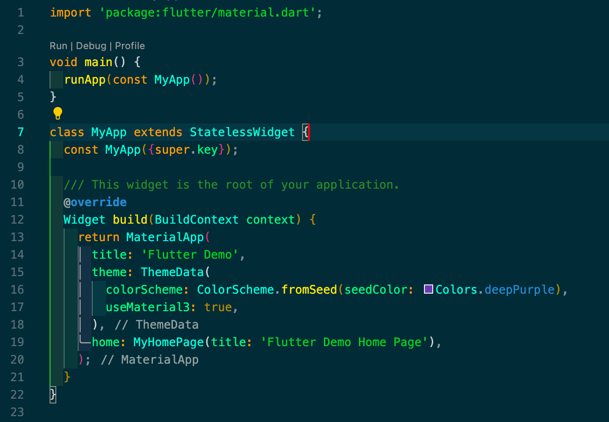
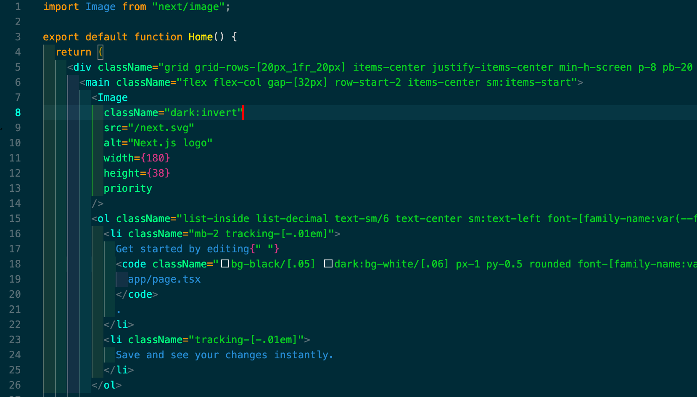
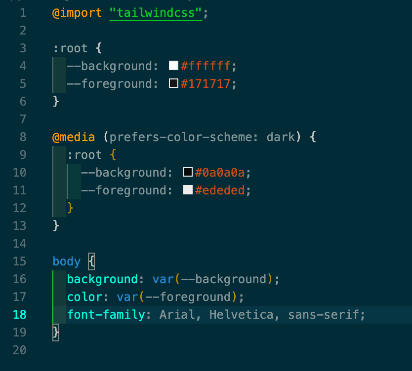
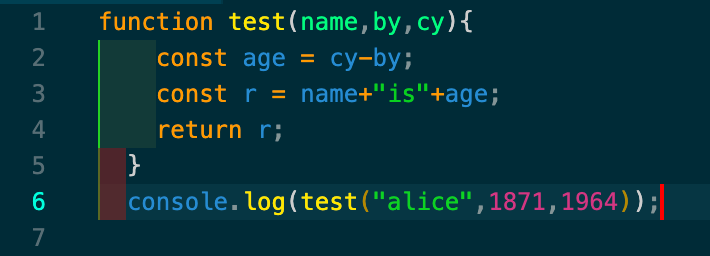

# 🎨 **King Rittik Dark Theme**

The **King Rittik Dark Theme** is a sleek, modern, and highly optimized dark theme designed to give your VS Code a clean, aesthetic, and productivity-boosting vibe. It's the exact theme you've seen in all my **[YouTube videos](https://www.youtube.com/@king_rittik)**! 🔥

> Perfect for developers who love a **cozy, distraction-free coding experience**. Whether you're writing Flutter, JavaScript, Python, or any other language — this theme makes your code pop! 💻

---

💥 If you like this theme and would like to support me making cool stuff on here and YouTube, you can [Sponsor me](https://github.com/sponsors/RittikSoni) on GitHub!

--

## ✨ **Features You'll Love**

✅ **Vibrant Color Palette** – Carefully chosen colors to reduce eye strain and boost focus.  
✅ **Cozy UI Elements** – Subtle contrast that highlights key elements without overwhelming.  
✅ **Optimized for All Languages** – Seamlessly works with Dart, JavaScript, Python, and more!  
✅ **Minimal & Clean Design** – No flashy distractions, just a clean dev environment.

---

## 📸 **Sneak Peek**

### Flutter/dart



### TSX/JS/Tailwind



### Sass/SCSS/css



### JavaScript



👀 **Love what you see? Try it out now!**

---

## 🚀 **Installation**

### 👉 **From the VS Code Marketplace**

1. Open **Visual Studio Code**.
2. Go to the Extensions panel (`Ctrl/⌘ + Shift + X`).
3. Search for **King Rittik Dark Theme**.
4. Click **Install** and reload if necessary.

---

## 🎯 **How to Use It**

1. Press `Ctrl/⌘ + Shift + P` to open the command palette.
2. Search for and select `Preferences: Color Theme`.
3. Choose **King Rittik Dark Theme** from the list.

---

## 💡 **Pro Tip: Customize Further!**

For a more personalized experience, customize your `settings.json` to tweak the colors or add custom key bindings.

```json
"editor.fontFamily": "Fira Code, Consolas, 'Courier New', monospace",
"editor.fontSize": 14,
"editor.lineHeight": 22
```

---

## ❤️ **Like This Theme?**

- ⭐️ **[Rate It on the Marketplace](http://marketplace.visualstudio.com/items?itemName=KingRittik.rs-dark)**
- 📢 Share it with fellow devs who love a clean and cozy coding environment!

---

## 🤝 **Contributing & Feedback**

Spotted a bug? Want to suggest improvements?

- 🐛 Open an [Issue](https://github.com/RittikSoni/King-Rittik-Dark-Theme/issues).
- 📩 Drop me a DM or connect on [Discord](https://discord.gg/Tmn6BKwSnr).

---

## 🔥 **Follow Me for More!**

- 📺 [YouTube: King Rittik](https://www.youtube.com/@king_rittik?sub_confirmation=1)

🚀 **Happy Coding with King Rittik Dark Theme!** 🚀
